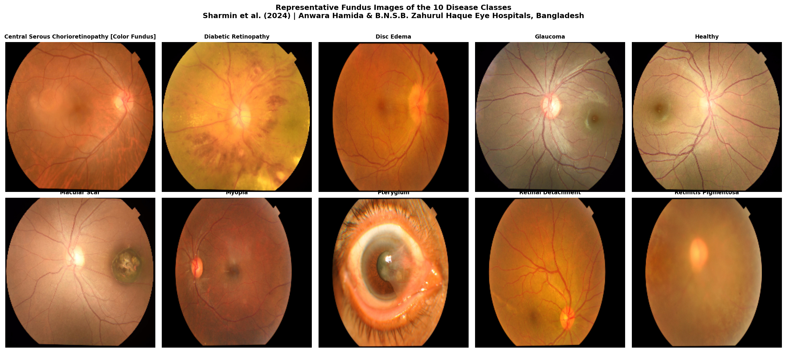
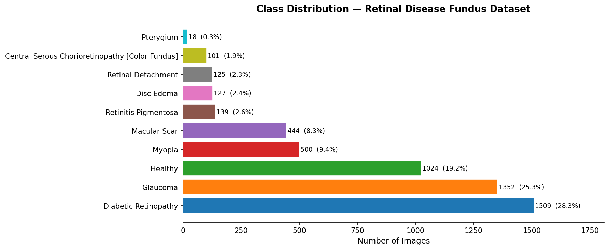
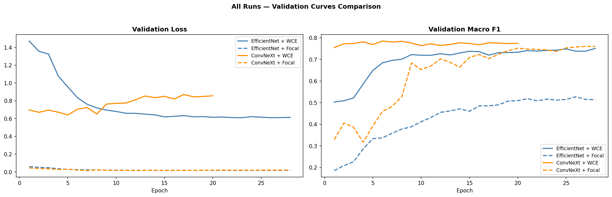
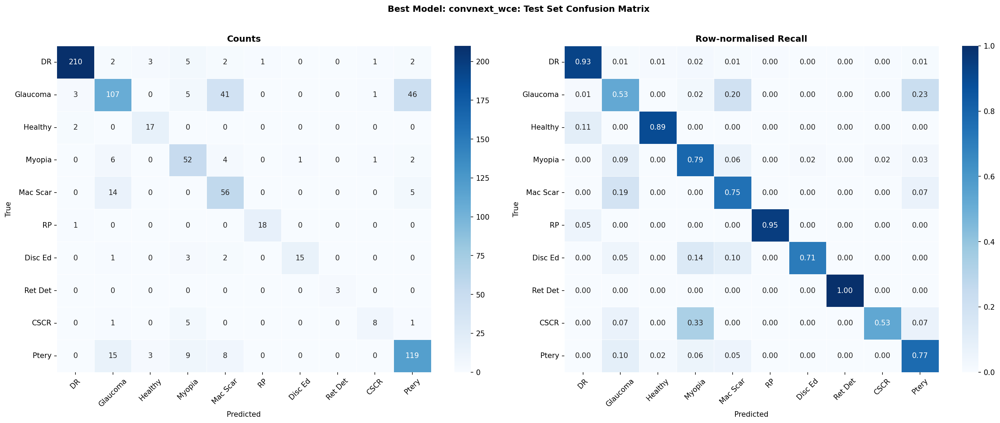
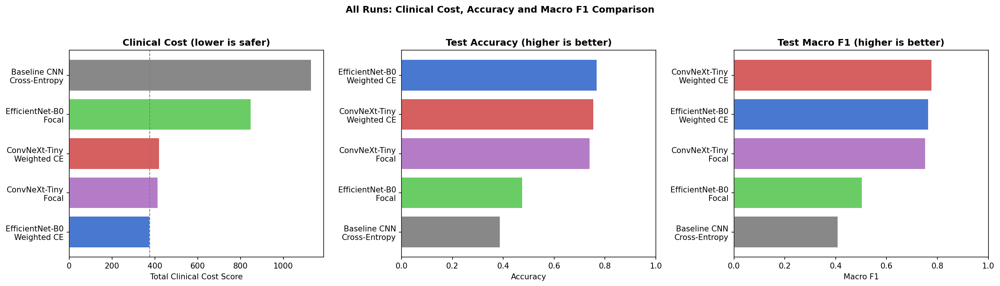

# **RETINAL DISEASE CLASSIFICATION FROM FUNDUS IMAGES**
## MSB7216: Deep Learning for Health Data Final Examination Project
### NAME: **`Kirunda Jeremy Menya`**
### REG NO.: **`2025/HD07/25995U`**
### STUDENT NO.: **`2500725995`**

*Makerere University | May 2026*


*Sample fundus images from each of the 10 disease classes in the dataset.*

---

## Contents
1. [Project Overview](#project-overview)
2. [Clinical Background](#clinical-background)
3. [Dataset](#dataset)
4. [Repository Structure](#repository-structure)
5. [Methodology](#methodology)
6. [Experimental Design](#experimental-design)
7. [Results](#results)
8. [Explainability](#explainability)
9. [Clinical Cost Evaluation](#clinical-cost-evaluation)
10. [Deployment](#deployment)
11. [Setup and Usage](#setup-and-usage)
12. [Ethical Considerations](#ethical-considerations)
13. [References](#references)

---

## Project Overview

Retinal fundus photography is one of the most widely used non-invasive tools for diagnosing eye disease. Skilled ophthalmologists can identify conditions ranging from diabetic retinopathy to glaucoma by examining the structure of the retina, optic disc, and blood vessels in a fundus image. However, access to such specialists is severely limited in low and middle-income countries, including in the Bangladeshi clinical setting from which this dataset originates.

This project builds and evaluates a deep learning pipeline for **multi-class classification of 10 retinal diseases** from fundus photographs. Beyond standard accuracy metrics, the project introduces a **clinically-grounded confusion cost framework** that penalises misclassifications according to their real-world clinical severity, recognising that confusing Diabetic Retinopathy with a Healthy retina is far more dangerous than confusing Myopia with Pterygium.

**Key questions this project addresses:**
- Can a fine-tuned CNN reliably distinguish between 10 retinal diseases from fundus images collected in a resource-limited clinical setting?
- Does Focal Loss outperform weighted cross-entropy for rare and clinically critical classes?
- Do EfficientNet-B0 and ConvNeXt-Tiny attend to the same retinal structures when making predictions, and does that alignment correlate with clinical correctness?
- Which misclassifications carry the highest clinical cost, and how does loss function choice affect that distribution?

---

## Clinical Background

Understanding the diseases in this dataset is essential for interpreting model behaviour. A model that confuses two visually similar but clinically distinct conditions is not equivalent to one that misclassifies a severe disease as healthy.

### Diabetic Retinopathy
Damage to the blood vessels of the retina caused by prolonged high blood sugar in diabetic patients. It is the leading cause of preventable blindness worldwide. Early detection is critical because patients are often asymptomatic until vision loss is irreversible. Key features visible in fundus images include microaneurysms, haemorrhages, exudates, and neovascularisation.

### Glaucoma
A group of conditions characterised by progressive optic nerve damage, typically associated with elevated intraocular pressure. Often called the "silent thief of sight" because peripheral vision loss is gradual and patients rarely notice it until advanced stages. Fundus findings include increased cup-to-disc ratio and optic disc pallor.

### Disc Edema
Swelling of the optic disc (papilloedema) caused by increased intracranial pressure, malignant hypertension, or optic neuritis. It presents as blurred disc margins and an elevated optic nerve head. Distinguishing disc edema from glaucoma is a common and clinically consequential diagnostic challenge.

### Macular Scar
Fibrous or atrophic changes at the macular (the region of the retina responsible for central vision) resulting from previous inflammation, infection (e.g. toxoplasmosis), or trauma. Central visual acuity is typically affected.

### Myopia (Pathological)
High myopia causes structural changes to the retina including posterior staphyloma, lattice degeneration, and increased risk of retinal detachment. Fundus images may show a large optic disc, crescent-shaped peripapillary atrophy, and a tessellated appearance.

### Retinal Detachment
Separation of the neurosensory retina from the underlying retinal pigment epithelium. This is a medical emergency which without prompt treatment, permanent vision loss is likely. Fundus images show an elevated, billowing retinal surface.

### Retinitis Pigmentosa
A hereditary degenerative condition causing progressive loss of peripheral vision due to photoreceptor death. Fundus hallmarks include bone-spicule pigmentation in the mid-periphery, waxy disc pallor, and attenuated blood vessels.

### Pterygium
A benign growth of fibrovascular tissue from the conjunctiva onto the cornea. While not a retinal disease, it is captured in fundus imaging and can cause irregular astigmatism and reduced visual acuity if it encroaches on the visual axis.

### Central Serous Chorioretinopathy (CSCR)
Accumulation of fluid beneath the retina, typically at the macula, causing a localised detachment. More common in young to middle-aged men and associated with stress and corticosteroid use. Often resolves spontaneously but can recur.

### Healthy
Normal retinal architecture with no pathological findings. A clear optic disc with defined margins, uniform blood vessel calibre, and an intact macula.

---

## Dataset

**Eye Disease Image Dataset**
Sharmin et al. (2024): Images collected from **Anwara Hamida Eye Hospital** and **B.N.S.B. Zahurul Haque Eye Hospital**, Faridpur, Bangladesh.

|Property |Detail |
|:---|:---|
| Source | [Mendeley Data](https://data.mendeley.com/datasets/s9bfhswzjb/1) |
| License | CC BY 4.0 (freely usable for research and education) |
| Total images | 5,335 original fundus images |
| Classes | 10 |
| Augmented versions | Available but excluded (see below) |
| Image type | Colour fundus photographs |
| Clinical origin | Two ophthalmology hospitals, Faridpur, Bangladesh |

**Class distribution:**


*Class distribution across the 10 disease categories. Populated after EDA.*

| Class | Disease | Images |
|:---|:---|:---|
| 0 | Diabetic Retinopathy | 1,509 |
| 1 | Glaucoma | 1,352 |
| 2 | Disc Edema | 127 |
| 3 | Macular Scar | 444 |
| 4 | Myopia | 500 |
| 5 | Retinal Detachment | 125 |
| 6 | Retinitis Pigmentosa | 139 |
| 7 | Pterygium | 18 |
| 8 | Central Serous Chorioretinopathy | 101 |
| 9 | Healthy | 1,024 |

*Exact counts populated after EDA (01_EDA.ipynb).*

**Why original images only?**
The dataset includes augmented versions of each image. Using these alongside originals risks **data leakage** because augmented versions of a training image could appear in the validation or test set, artificially inflating performance metrics. Only the 5,335 original fundus images are used throughout this project.

---

## Repository Structure

```
retinal-disease-classification/
│
├── data/                              # Raw images, not tracked by git (see .gitignore)
│   └── raw/
│
├── notebooks/
│   ├── 01_EDA.ipynb                   # Class distribution, image quality audit, green channel analysis
│   ├── 02_Preprocessing_Baseline.ipynb # CLAHE preprocessing, train/val/test split, baseline CNN
│   ├── 03_Architecture_Comparison.ipynb # EfficientNet-B0 vs ConvNeXt-Tiny × 2 loss functions
│   ├── 04_Explainability_GradCAM.ipynb # Grad-CAM heatmaps, cross-architecture comparison
│   └── 05_Error_Analysis.ipynb        # Confusion matrix, clinical cost score, failure case review
│
├── src/
│   ├── dataset.py                     # PyTorch Dataset class with stratified splitting
│   ├── train.py                       # Training loop with early stopping
│   ├── evaluate.py                    # Accuracy, F1, per-class recall, clinical cost score
│   ├── focal_loss.py                  # Focal Loss implementation
│   └── gradcam.py                     # Grad-CAM extraction and overlay utilities
│
├── models/                            # Saved .pth checkpoints — not tracked by git
│                                      # Download link: [Google Drive](YOUR_DRIVE_LINK_HERE)
│
├── reports/
│   └── final_report.pdf              # [View Report](YOUR_DRIVE_LINK_HERE)
│
├── figures/
│   ├── class_sample_grid.png          # One sample per disease class
│   ├── class_distribution.png         # Class balance bar chart
│   ├── preprocessing_comparison.png   # Raw vs CLAHE vs green channel
│   ├── training_curves/               # Loss and accuracy curves per run
│   ├── confusion_matrix_best.png      # Confusion matrix of best model
│   ├── clinical_cost_comparison.png   # Clinical cost scores across all runs
│   └── gradcam/                       # Grad-CAM overlays per class per architecture
│
├── app/
│   └── app.py                         # Gradio demo — single image inference with Grad-CAM overlay
│
├── configs/
│   └── experiment_config.yaml         # All hyperparameters in one place for reproducibility
│
├── requirements.txt
└── README.md
```

---

## Methodology

### Preprocessing
Fundus images from clinical settings often suffer from variable illumination, low contrast, and lens artefacts. The preprocessing pipeline addresses this with:
- **Green channel extraction:** the green channel of a fundus image carries the highest contrast for retinal vessels and lesions
- **CLAHE (Contrast Limited Adaptive Histogram Equalization):** enhances local contrast without amplifying noise
- **Resizing** to 224×224 pixels for compatibility with pretrained architectures
- **Normalisation** using ImageNet mean and standard deviation (for transfer learning compatibility)


*Left to right: original fundus image, green channel extraction, CLAHE-enhanced output.*

### Baseline Model
A simple custom CNN trained from scratch serves as the performance floor. This establishes what is achievable without transfer learning and provides a meaningful point of comparison.

### Transfer Learning
Both fine-tuned models are initialised with ImageNet pretrained weights. Training proceeds in two phases:
1. **Frozen backbone:** Only the classification head is trained for a few epochs to stabilise weights
2. **Full fine-tuning:** The entire network is unfrozen and trained at a lower learning rate

### Class Imbalance
Two strategies are compared:
- **Weighted Cross-Entropy:** assigns higher loss weight to underrepresented classes
- **Focal Loss:** dynamically down-weights easy examples during training, forcing the model to focus on hard and rare cases. Particularly relevant for rare diseases like Retinal Detachment and CSCR in this dataset

---

## Experimental Design

- 4 model runs
- 2 architectures × 2 loss functions
- All evaluated on a held-out test set:

| Run | Architecture | Loss Function | Rationale |
|:---|:---|:---|:---|
| 1 | EfficientNet-B0 | Weighted Cross-Entropy | Established baseline with standard imbalance handling |
| 2 | EfficientNet-B0 | Focal Loss | Effect of loss function on rare-class recall |
| 3 | ConvNeXt-Tiny | Weighted Cross-Entropy | Modern architecture, same loss for fair comparison |
| 4 | ConvNeXt-Tiny | Focal Loss | Best candidate (modern architecture + imbalance-aware loss) |

All runs use identical: train/val/test splits, image preprocessing, data augmentation strategy, optimiser (AdamW), learning rate schedule (cosine annealing), and number of epochs.

---

## Results


*Training and validation loss curves across all four experimental runs.*

*(Metrics populated after experiments; 03_Architecture_Comparison)*

| Architecture | Loss | Accuracy | Macro F1 | Clinical Cost ↓ |
|:---|:---|:---|:---|:---|
| Baseline CNN | Cross-Entropy | — | — | — |
| EfficientNet-B0 | Weighted CE | — | — | — |
| EfficientNet-B0 | Focal Loss | — | — | — |
| ConvNeXt-Tiny | Weighted CE | — | — | — |
| ConvNeXt-Tiny | Focal Loss | — | — | — |


*Confusion matrix of the best-performing model on the held-out test set.*

---

## Explainability

Grad-CAM (Gradient-weighted Class Activation Mapping) is applied to both architectures to visualise which regions of a fundus image influence the model's prediction.


*Grad-CAM overlays from EfficientNet-B0 (top) and ConvNeXt-Tiny (bottom) for matched correct predictions across selected disease classes.*

Rather than using Grad-CAM as a visual checkbox, this project uses it analytically:
- **Cross-architecture comparison:** Do EfficientNet-B0 and ConvNeXt-Tiny attend to the same retinal structures for the same prediction?
- **Clinical alignment check:** Do the highlighted regions correspond to known pathological features (e.g. optic disc for Glaucoma, haemorrhage locations for Diabetic Retinopathy)?
- **Disagreement analysis:** Cases where the model is correct but Grad-CAM highlights clinically irrelevant regions are flagged as potentially fragile predictions.

---

## Clinical Cost Evaluation

Standard accuracy treats all misclassifications equally. Clinically, they are not.

A **10×10 confusion cost matrix** is constructed where each cell (i, j) represents the clinical severity of predicting class j when the true class is i. The matrix is informed by:
- **Urgency of the condition:** Retinal Detachment and Disc Edema require emergency referral; Pterygium does not
- **Consequences of delay:** Missing Diabetic Retinopathy or Glaucoma leads to irreversible blindness
- **Similarity of presentation:** Confusing two visually similar conditions (e.g. Disc Edema and Glaucoma) is weighted differently from confusing a severe disease with Healthy


*Clinical cost scores across all four model runs. Lower is better.*

Each model is evaluated by a **weighted clinical cost score:** the sum of (confusion count × cost) across all off-diagonal cells. A lower score is better. This metric rewards models that, when they do make errors, make *safer* errors.

---

## Deployment

A Gradio web demo (`app/app.py`) allows single-image inference with:
- Predicted disease class and confidence score
- Top-3 class probabilities
- Grad-CAM heatmap overlaid on the input fundus image

**Live demo:** [Hugging Face Space](YOUR_HF_SPACE_LINK_HERE) *(link active after Thursday)*

To run locally:
```bash
python app/app.py
```

---

## Submission Links

| Deliverable | Link |
|:---|:---|
| 📄 Final Report (PDF) | [Google Drive](YOUR_REPORT_LINK_HERE) |
| 💻 GitHub Repository | [retinal-disease-classification](https://github.com/<you>/retinal-disease-classification) |
| 🎞️ Presentation Slides | [Google Drive](YOUR_SLIDES_LINK_HERE) |
| 🚀 Live Demo | [Hugging Face Space](YOUR_HF_SPACE_LINK_HERE) |
| 🧠 Model Weights | [Google Drive](YOUR_WEIGHTS_LINK_HERE) |

---

## Setup and Usage

**Requirements:** Python 3.10+, CUDA-compatible GPU recommended (or Google Colab)

```bash
git clone https://github.com/<your-username>/retinal-disease-classification.git
cd retinal-disease-classification
pip install -r requirements.txt
```

Place the dataset images under `data/raw/` following the original Mendeley folder structure.

**Running on Google Colab:**
```python
!git clone https://github.com/<your-username>/retinal-disease-classification.git
%cd retinal-disease-classification
!pip install -r requirements.txt

from google.colab import drive
drive.mount('/content/drive')
DATA_PATH = '/content/drive/MyDrive/retinal-disease-classification/data/raw'
```

Notebooks are designed to run in order (01 → 05). Each notebook is self-contained and includes a final cell to commit and push results to GitHub.

---

## Ethical Considerations

- **Patient data:** All images are anonymised and sourced from a published dataset under CC BY 4.0. No patient-identifiable information is present or used.
- **Clinical context:** This model is a research prototype built for an academic project. It is not validated for clinical use and should not be used to inform real patient care decisions.
- **Fairness and generalisability:** The dataset originates from two hospitals in Faridpur, Bangladesh. Model performance may not generalise to fundus images acquired with different equipment, lighting conditions, or patient demographics. This limitation is discussed explicitly in the report.
- **Deployment context:** Any real-world deployment of a model like this in a resource-limited clinical setting would require prospective clinical validation, regulatory approval, and integration with appropriate clinical oversight.

---

## References

- Sharmin et al. (2024). Eye Disease Image Dataset. *Mendeley Data*. https://data.mendeley.com/datasets/s9bfhswzjb/1
- Tan, M. & Le, Q. (2019). EfficientNet: Rethinking Model Scaling for Convolutional Neural Networks. *ICML*.
- Liu, Z. et al. (2022). A ConvNet for the 2020s. *CVPR*. https://arxiv.org/abs/2201.03545
- Lin, T. et al. (2017). Focal Loss for Dense Object Detection. *ICCV*. https://arxiv.org/abs/1708.02002
- Selvaraju, R. et al. (2017). Grad-CAM: Visual Explanations from Deep Networks via Gradient-based Localization. *ICCV*. https://arxiv.org/abs/1610.02391
- Topol, E. (2019). *Deep Medicine: How Artificial Intelligence Can Make Healthcare Human Again*. Basic Books.
